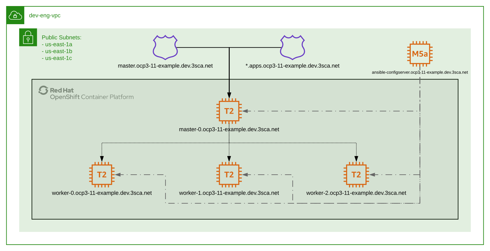

# tf-openshift-3.11

[](https://github.com/3scale-ops/tf-openshift-3.11/actions/workflows/format-tests.yaml?query=workflow%3Aformat-tests)
[](https://github.com/3scale-ops/tf-openshift-3.11/blob/main/LICENSE)

Terraform module to deploy the OpenShift 3.11 cluster required infrastructure and deploys the cluster from an ansible server.

- [tf-openshift-3.11](#tf-openshift-311)
  - [Terraform module](#terraform-module)
    - [Module Variables](#module-variables)
    - [Module example](#module-example)
      - [Example parameters](#example-parameters)
      - [Example cluster creation](#example-cluster-creation)
      - [Example cluster deletion](#example-cluster-deletion)

## Terraform module

### Module Variables

| Name                           | Description                                   |
| ------------------------------ | --------------------------------------------- |
| name                           | Cluster name                                  |
| attributes                     | Additional attributes for the naming          |
| tags                           | Additional tags for the resources             |
| vpc_id                         | AWS VPC Id for the cluster instances          |
| private_subnet_ids             | AWS VPC Private Subned Ids for the instances  |
| public_subnet_ids              | AWS VPC Public Subned Ids for the instances   |
| dns_zone                       | Cluster Route53 DNS Zone Id                   |
| dns_name                       | Cluster Route53 DNS Zone Name                 |
| masters_count                  | Number of master nodes                        |
| workers_count                  | Number of worker nodes                        |
| openshift_key_pair             | AWS Key pair for the EC2 instances            |
| admin_password                 | `admin` user htpasswd for the cluster, hashed |
| identity_providers             | OCP identity providers json configuration     |
| oreg_auth_user                 | Red Hat registry user name                    |
| oreg_auth_password             | Red Hat registry user password                |
| redhat_registry_auth           | Access key for accessing `registry.redhat.io` |
| quay_registry_auth             | Access key for accessing `quay.io` registry   |
| terminate_ansible_configserver | Terminate the config server after deploy      |

### Module example



The terraform module will create a single master instance pointed by the DNS record `master-0.$dns_name` and a `var.workers_count` number of worker instances pointed by DNS records `worker-#.$dns_name`.

Those instances will be ready to run the OCP installer: basic software required via user-data for installing OCP, proper IAM roles, users, network configuration, ...

Once the instances are created, it will deploy an ansible configserver pointed by the DNS record `ansible-configserver.$dns_name`.

This instance will:

  - Install basic dependencies required for the cluster deployment (using the user-data)
  - Copy the rendender ansible inventory with the list of nodes created before [~/openshift-ansible-inventory.cfg](files/ansible-configserver-inventory.tpl)
  - Copy and run the installer script [~/ansible-configserver-run.sh](files/ansible-configserver-run.sh) that will:
    - Wait for cloud-init completion
    - Checkout openshfit-ansible 3.11 GitHub repo
    - Apply with ansible the `prerequisites` playbook using the rendered inventory
    - Apply with ansible the `deploy_cluster` playbook using the rendered inventory
    - Shutdowns itself

#### Example parameters

```terraform
module "ocp3_11_cluster" {
  source               = "git@github.com:3scale/tf-openshift-3.11.git?ref=tags/v0.1"
  name                 = "ocp3-11-example"
  openshift_key_pair   = "ec2-key"
  dns_zone             = "ZABCD12345"
  dns_name             = "ocp3-11-example.3sca.net"
  vpc_id               = "vpc-12345678"
  private_subnet_ids   = "subnet-12345abd"
  public_subnet_ids    = "subnet-67890efg"
  oreg_auth_user       = "SecretRedhatSubscriptionUserName",
  oreg_auth_password   = "SecretRedhatSubscriptionPassword",
  admin_password       = "SecretOpenShiftAdminPassword",
  quay_registry_auth   = "SecretQuayRegistryDockerAuth",
  redhat_registry_auth = "SecretRedhatRegistryDockerAuth",
  identity_providers   = "SecretOpenshiftMasterIdentityProviders",
}
```

#### Example cluster creation

Run `tf apply --auto-approve`and wait for about 25 minutes.

- Retrieving the current state from the S3 terraform state backend

```
Acquiring state lock. This may take a few moments...
module.ocp3_11_cluster.data.template_file.ansible_configserver_run: Refreshing state...
module.ocp3_11_cluster.data.template_file.ansible_configserver_userdata: Refreshing state...
data.terraform_remote_state.vpc: Refreshing state...
data.terraform_remote_state.dev_3sca_net: Refreshing state...
...
```

- Creating the AWS resources required for the EC2 instances

```
...
module.ocp3_11_cluster.aws_iam_policy.ocp_forward_logs_iam_policy: Creating...
module.ocp3_11_cluster.aws_iam_user.ocp_iam_user: Creating...
module.ocp3_11_cluster.aws_iam_role.ocp_instance_role: Creating...
aws_route53_zone.cluster_zone: Creating...
module.ocp3_11_cluster.aws_security_group.sg_nodes: Creating...
module.ocp3_11_cluster.aws_iam_role.ocp_instance_role: Creation complete after 1s [id=dev-eng-ocp3-11-cluster-instance-role]
module.ocp3_11_cluster.aws_iam_instance_profile.ocp_instance_profile: Creating...
module.ocp3_11_cluster.aws_iam_user.ocp_iam_user: Creation complete after 1s [id=dev-eng-ocp3-11-cluster-user]
module.ocp3_11_cluster.aws_iam_user_policy.ocp_iam_user_policy: Creating...
module.ocp3_11_cluster.aws_iam_access_key.ocp_iam_user: Creating...
module.ocp3_11_cluster.aws_iam_policy.ocp_forward_logs_iam_policy: Creation complete after 2s [id=arn:aws:iam::**********:policy/dev-eng-ocp3-11-cluster-forward-logs-policy]
module.ocp3_11_cluster.aws_iam_policy_attachment.ocp_forward_logs_iam_policy_attachment: Creating...
module.ocp3_11_cluster.aws_iam_access_key.ocp_iam_user: Creation complete after 1s [id=******************]
module.ocp3_11_cluster.aws_iam_user_policy.ocp_iam_user_policy: Creation complete after 1s [id=dev-eng-ocp3-11-cluster-user:dev-eng-ocp3-11-cluster-user-policy]
module.ocp3_11_cluster.aws_iam_instance_profile.ocp_instance_profile: Creation complete after 2s [id=dev-eng-ocp3-11-cluster-instance-profile]
module.ocp3_11_cluster.aws_iam_policy_attachment.ocp_forward_logs_iam_policy_attachment: Creation complete after 1s [id=openshift-attachment-forward-logs]
module.ocp3_11_cluster.aws_security_group.sg_nodes: Creation complete after 6s [id=sg-062a16445881ad0fd]
...
```

- Creating the master and worker nodes EC2 instances and domains

```
module.ocp3_11_cluster.aws_instance.worker[1]: Creating...
module.ocp3_11_cluster.aws_instance.worker[2]: Creating...
module.ocp3_11_cluster.aws_instance.master[0]: Creating...
module.ocp3_11_cluster.aws_instance.worker[0]: Creating...
...
module.ocp3_11_cluster.aws_route53_record.worker_node_dns[0]: Creation complete after 40s [id=ZABCD6789_worker-0.ocp3-11-example.3sca.net_A]
module.ocp3_11_cluster.aws_route53_record.worker_node_dns[2]: Still creating... [40s elapsed]
module.ocp3_11_cluster.aws_route53_record.worker_node_internal_dns[2]: Still creating... [40s elapsed]
module.ocp3_11_cluster.aws_route53_record.worker_node_internal_dns[1]: Still creating... [40s elapsed]
module.ocp3_11_cluster.aws_route53_record.cluster_zone_delegation: Creation complete after 41s [id=ZABCD6789_ansible-configserver.ocp3-11-example.3sca.net_A]
module.ocp3_11_cluster.aws_route53_record.master_dns: Creation complete after 41s [id=ZABCD6789_master.ocp3-11-example.3sca.net_A]
module.ocp3_11_cluster.aws_route53_record.worker_node_dns[2]: Creation complete after 41s [id=ZABCD6789_worker-2.ocp3-11-example.3sca.net_A]
module.ocp3_11_cluster.aws_route53_record.master_node_internal_dns[0]: Creation complete after 42s [id=ZABCD6789_master-0-int.ocp3-11-example.3sca.net_A]
module.ocp3_11_cluster.aws_route53_record.worker_node_internal_dns[1]: Creation complete after 42s [id=ZABCD6789_worker-1-int.ocp3-11-example.3sca.net_A]
module.ocp3_11_cluster.aws_route53_record.worker_node_internal_dns[2]: Creation complete after 43s [id=ZABCD6789_worker-2-int.ocp3-11-example.3sca.net_A]
module.ocp3_11_cluster.aws_route53_record.worker_node_dns[1]: Still creating... [10s elapsed]
module.ocp3_11_cluster.aws_route53_record.worker_node_internal_dns[0]: Still creating... [10s elapsed]
module.ocp3_11_cluster.aws_route53_record.worker_node_dns[1]: Still creating... [20s elapsed]
module.ocp3_11_cluster.aws_route53_record.worker_node_internal_dns[0]: Still creating... [20s elapsed]
module.ocp3_11_cluster.aws_route53_record.worker_node_dns[1]: Still creating... [30s elapsed]
module.ocp3_11_cluster.aws_route53_record.worker_node_internal_dns[0]: Still creating... [30s elapsed]
module.ocp3_11_cluster.aws_route53_record.worker_node_internal_dns[0]: Creation complete after 34s [id=ZABCD6789_worker-0-int.ocp3-11-example.3sca.net_A]
module.ocp3_11_cluster.aws_route53_record.worker_node_dns[1]: Creation complete after 34s [id=ZABCD6789_worker-1.ocp3-11-example.3sca.net_A]
```

- Creating the ansible-configserver

```
...
module.ocp3_11_cluster.aws_instance.ansible_configserver[0]: Creating...
module.ocp3_11_cluster.aws_instance.ansible_configserver[0]: Still creating... [10s elapsed]
module.ocp3_11_cluster.aws_instance.ansible_configserver[0]: Provisioning with 'file'...
module.ocp3_11_cluster.aws_instance.ansible_configserver[0]: Still creating... [20s elapsed]
module.ocp3_11_cluster.aws_instance.ansible_configserver[0]: Still creating... [30s elapsed]
module.ocp3_11_cluster.aws_instance.ansible_configserver[0]: Provisioning with 'file'...
module.ocp3_11_cluster.aws_instance.ansible_configserver[0]: Provisioning with 'remote-exec'...
module.ocp3_11_cluster.aws_instance.ansible_configserver[0] (remote-exec): Connecting to remote host via SSH...
module.ocp3_11_cluster.aws_instance.ansible_configserver[0] (remote-exec):   Host: 54.87.164.75
module.ocp3_11_cluster.aws_instance.ansible_configserver[0] (remote-exec):   User: ec2-user
module.ocp3_11_cluster.aws_instance.ansible_configserver[0] (remote-exec):   Password: false
module.ocp3_11_cluster.aws_instance.ansible_configserver[0] (remote-exec):   Private key: false
module.ocp3_11_cluster.aws_instance.ansible_configserver[0] (remote-exec):   Certificate: false
module.ocp3_11_cluster.aws_instance.ansible_configserver[0] (remote-exec):   SSH Agent: true
module.ocp3_11_cluster.aws_instance.ansible_configserver[0] (remote-exec):   Checking Host Key: false
module.ocp3_11_cluster.aws_instance.ansible_configserver[0] (remote-exec): Connected!
module.ocp3_11_cluster.aws_instance.ansible_configserver[0]: Still creating... [40s elapsed]
module.ocp3_11_cluster.aws_instance.ansible_configserver[0] (remote-exec): + timeout 300 sed '/finish:\smodules-final:\sSUCCESS/q' /dev/fd/63
module.ocp3_11_cluster.aws_instance.ansible_configserver[0] (remote-exec): ++ tail -f /var/log/cloud-init.log
module.ocp3_11_cluster.aws_instance.ansible_configserver[0] (remote-exec): Mar 11 10:51:57 cloud-init[2787]: stages.py[DEBUG]: Running module scripts-per-instance (<module 'cloudinit.config.cc_scripts_per_instance' from '/usr/lib/python2.7/site-packages/cloudinit/config/cc_scripts_per_instance.pyc'>) with frequency once-per-instance
module.ocp3_11_cluster.aws_instance.ansible_configserver[0] (remote-exec): Mar 11 10:51:57 cloud-init[2787]: handlers.py[DEBUG]: start: modules-final/config-scripts-per-instance: running config-scripts-per-instance with frequency once-per-instance
module.ocp3_11_cluster.aws_instance.ansible_configserver[0] (remote-exec): Mar 11 10:51:57 cloud-init[2787]: util.py[DEBUG]: Writing to /var/lib/cloud/instances/i-06e1511441879ee08/sem/config_scripts_per_instance - wb: [644] 20 bytes
module.ocp3_11_cluster.aws_instance.ansible_configserver[0] (remote-exec): Mar 11 10:51:57 cloud-init[2787]: helpers.py[DEBUG]: Running config-scripts-per-instance using lock (<FileLock using file '/var/lib/cloud/instances/i-06e1511441879ee08/sem/config_scripts_per_instance'>)
...
```

- Cloning the OpenShift ansible GitHub repo (branch for the 3.11 version) and running the playbooks

```
...
odule.ocp3_11_cluster.aws_instance.ansible_configserver[0] (remote-exec): + shift
module.ocp3_11_cluster.aws_instance.ansible_configserver[0] (remote-exec): + local -r '__run=git clone -q -b release-3.11 https://github.com/openshift/openshift-ansible openshift-ansible'
module.ocp3_11_cluster.aws_instance.ansible_configserver[0] (remote-exec): + local -i __backoff_delay=2
module.ocp3_11_cluster.aws_instance.ansible_configserver[0] (remote-exec): + git clone -q -b release-3.11 https://github.com/openshift/openshift-ansible openshift-ansible
module.ocp3_11_cluster.aws_instance.ansible_configserver[0]: Still creating... [2m30s elapsed]
module.ocp3_11_cluster.aws_instance.ansible_configserver[0] (remote-exec): + export ANSIBLE_HOST_KEY_CHECKING=False
module.ocp3_11_cluster.aws_instance.ansible_configserver[0] (remote-exec): + ANSIBLE_HOST_KEY_CHECKING=False
module.ocp3_11_cluster.aws_instance.ansible_configserver[0] (remote-exec): + retry_command 20 ansible-playbook -i ./openshift-ansible-inventory.cfg ./openshift-ansible/playbooks/prerequisites.yml
module.ocp3_11_cluster.aws_instance.ansible_configserver[0] (remote-exec): + local -r __tries=20
module.ocp3_11_cluster.aws_instance.ansible_configserver[0] (remote-exec): + shift
module.ocp3_11_cluster.aws_instance.ansible_configserver[0] (remote-exec): + local -r '__run=ansible-playbook -i ./openshift-ansible-inventory.cfg ./openshift-ansible/playbooks/prerequisites.yml'
module.ocp3_11_cluster.aws_instance.ansible_configserver[0] (remote-exec): + local -i __backoff_delay=2
module.ocp3_11_cluster.aws_instance.ansible_configserver[0] (remote-exec): + ansible-playbook -i ./openshift-ansible-inventory.cfg ./openshift-ansible/playbooks/prerequisites.yml
module.ocp3_11_cluster.aws_instance.ansible_configserver[0] (remote-exec): PLAY [Fail openshift_kubelet_name_override for new hosts] **********************
module.ocp3_11_cluster.aws_instance.ansible_configserver[0] (remote-exec): TASK [Gathering Facts] *********************************************************
module.ocp3_11_cluster.aws_instance.ansible_configserver[0] (remote-exec): ok: [master-0-int.ocp3-11-example.3sca.net]
module.ocp3_11_cluster.aws_instance.ansible_configserver[0] (remote-exec): ok: [worker-2-int.ocp3-11-example.3sca.net]
module.ocp3_11_cluster.aws_instance.ansible_configserver[0] (remote-exec): ok: [worker-0-int.ocp3-11-example.3sca.net]
module.ocp3_11_cluster.aws_instance.ansible_configserver[0] (remote-exec): ok: [worker-1-int.ocp3-11-example.3sca.net]
module.ocp3_11_cluster.aws_instance.ansible_configserver[0] (remote-exec): TASK [Fail when openshift_kubelet_name_override is defined] ********************
module.ocp3_11_cluster.aws_instance.ansible_configserver[0] (remote-exec): skipping: [master-0-int.ocp3-11-example.3sca.net]
module.ocp3_11_cluster.aws_instance.ansible_configserver[0] (remote-exec): skipping: [worker-0-int.ocp3-11-example.3sca.net]
module.ocp3_11_cluster.aws_instance.ansible_configserver[0] (remote-exec): skipping: [worker-1-int.ocp3-11-example.3sca.net]
module.ocp3_11_cluster.aws_instance.ansible_configserver[0] (remote-exec): skipping: [worker-2-int.ocp3-11-example.3sca.net]
module.ocp3_11_cluster.aws_instance.ansible_configserver[0] (remote-exec): PLAY [Initialization Checkpoint Start] *****************************************
module.ocp3_11_cluster.aws_instance.ansible_configserver[0] (remote-exec): TASK [Set install initialization 'In Progress'] ********************************
module.ocp3_11_cluster.aws_instance.ansible_configserver[0] (remote-exec): ok: [master-0-int.ocp3-11-example.3sca.net]
module.ocp3_11_cluster.aws_instance.ansible_configserver[0] (remote-exec): PLAY [Populate config host groups] *********************************************
module.ocp3_11_cluster.aws_instance.ansible_configserver[0] (remote-exec): TASK [Load group name mapping variables] ***************************************
module.ocp3_11_cluster.aws_instance.ansible_configserver[0] (remote-exec): ok: [localhost]
...
```

- For a long...

```
...
module.ocp3_11_cluster.aws_instance.ansible_configserver[0] (remote-exec): TASK [openshift_node : Check status of node pod image pre-pull] ****************
module.ocp3_11_cluster.aws_instance.ansible_configserver[0] (remote-exec): changed: [worker-0-int.ocp3-11-example.3sca.net]
module.ocp3_11_cluster.aws_instance.ansible_configserver[0] (remote-exec): changed: [worker-1-int.ocp3-11-example.3sca.net]
module.ocp3_11_cluster.aws_instance.ansible_configserver[0] (remote-exec): changed: [master-0-int.ocp3-11-example.3sca.net]
module.ocp3_11_cluster.aws_instance.ansible_configserver[0] (remote-exec): changed: [worker-2-int.ocp3-11-example.3sca.net]

module.ocp3_11_cluster.aws_instance.ansible_configserver[0] (remote-exec): TASK [openshift_node : Copy node container image to ostree storage] ************
module.ocp3_11_cluster.aws_instance.ansible_configserver[0]: Still creating... [7m20s elapsed]
module.ocp3_11_cluster.aws_instance.ansible_configserver[0]: Still creating... [7m30s elapsed]
module.ocp3_11_cluster.aws_instance.ansible_configserver[0]: Still creating... [7m40s elapsed]
module.ocp3_11_cluster.aws_instance.ansible_configserver[0]: Still creating... [7m50s elapsed]
module.ocp3_11_cluster.aws_instance.ansible_configserver[0]: Still creating... [8m0s elapsed]
module.ocp3_11_cluster.aws_instance.ansible_configserver[0]: Still creating... [8m10s elapsed]
module.ocp3_11_cluster.aws_instance.ansible_configserver[0]: Still creating... [8m20s elapsed]
module.ocp3_11_cluster.aws_instance.ansible_configserver[0]: Still creating... [8m30s elapsed]
module.ocp3_11_cluster.aws_instance.ansible_configserver[0] (remote-exec): ok: [worker-2-int.ocp3-11-example.3sca.net]
module.ocp3_11_cluster.aws_instance.ansible_configserver[0] (remote-exec): ok: [worker-1-int.ocp3-11-example.3sca.net]
module.ocp3_11_cluster.aws_instance.ansible_configserver[0] (remote-exec): ok: [worker-0-int.ocp3-11-example.3sca.net]
...
```

- Long...

```
...
module.ocp3_11_cluster.aws_instance.ansible_configserver[0] (remote-exec): TASK [openshift_control_plane : fail] ******************************************
module.ocp3_11_cluster.aws_instance.ansible_configserver[0] (remote-exec): skipping: [master-0-int.ocp3-11-example.3sca.net]

module.ocp3_11_cluster.aws_instance.ansible_configserver[0] (remote-exec): TASK [openshift_control_plane : Wait for all control plane pods to come up and become ready] ***
module.ocp3_11_cluster.aws_instance.ansible_configserver[0] (remote-exec): FAILED - RETRYING: Wait for all control plane pods to come up and become ready (72 retries left).
module.ocp3_11_cluster.aws_instance.ansible_configserver[0] (remote-exec): FAILED - RETRYING: Wait for all control plane pods to come up and become ready (71 retries left).
module.ocp3_11_cluster.aws_instance.ansible_configserver[0]: Still creating... [13m50s elapsed]
module.ocp3_11_cluster.aws_instance.ansible_configserver[0] (remote-exec): FAILED - RETRYING: Wait for all control plane pods to come up and become ready (70 retries left).
module.ocp3_11_cluster.aws_instance.ansible_configserver[0] (remote-exec): FAILED - RETRYING: Wait for all control plane pods to come up and become ready (69 retries left).
module.ocp3_11_cluster.aws_instance.ansible_configserver[0]: Still creating... [14m0s elapsed]
module.ocp3_11_cluster.aws_instance.ansible_configserver[0] (remote-exec): FAILED - RETRYING: Wait for all control plane pods to come up and become ready (68 retries left).
module.ocp3_11_cluster.aws_instance.ansible_configserver[0]: Still creating... [14m10s elapsed]
module.ocp3_11_cluster.aws_instance.ansible_configserver[0]: Still creating... [14m20s elapsed]
module.ocp3_11_cluster.aws_instance.ansible_configserver[0] (remote-exec): FAILED - RETRYING: Wait for all control plane pods to come up and become ready (67 retries left).
module.ocp3_11_cluster.aws_instance.ansible_configserver[0] (remote-exec): FAILED - RETRYING: Wait for all control plane pods to come up and become ready (66 retries left).
module.ocp3_11_cluster.aws_instance.ansible_configserver[0]: Still creating... [14m30s elapsed]
module.ocp3_11_cluster.aws_instance.ansible_configserver[0] (remote-exec): FAILED - RETRYING: Wait for all control plane pods to come up and become ready (65 retries left).
module.ocp3_11_cluster.aws_instance.ansible_configserver[0] (remote-exec): FAILED - RETRYING: Wait for all control plane pods to come up and become ready (64 retries left).
module.ocp3_11_cluster.aws_instance.ansible_configserver[0]: Still creating... [14m40s elapsed]
module.ocp3_11_cluster.aws_instance.ansible_configserver[0] (remote-exec): FAILED - RETRYING: Wait for all control plane pods to come up and become ready (63 retries left).
module.ocp3_11_cluster.aws_instance.ansible_configserver[0]: Still creating... [14m50s elapsed]
module.ocp3_11_cluster.aws_instance.ansible_configserver[0] (remote-exec): FAILED - RETRYING: Wait for all control plane pods to come up and become ready (62 retries left).
module.ocp3_11_cluster.aws_instance.ansible_configserver[0] (remote-exec): FAILED - RETRYING: Wait for all control plane pods to come up and become ready (61 retries left).
module.ocp3_11_cluster.aws_instance.ansible_configserver[0]: Still creating... [15m0s elapsed]
module.ocp3_11_cluster.aws_instance.ansible_configserver[0] (remote-exec): FAILED - RETRYING: Wait for all control plane pods to come up and become ready (60 retries left).
module.ocp3_11_cluster.aws_instance.ansible_configserver[0] (remote-exec): FAILED - RETRYING: Wait for all control plane pods to come up and become ready (59 retries left).
module.ocp3_11_cluster.aws_instance.ansible_configserver[0]: Still creating... [15m10s elapsed]
module.ocp3_11_cluster.aws_instance.ansible_configserver[0] (remote-exec): FAILED - RETRYING: Wait for all control plane pods to come up and become ready (58 retries left).
module.ocp3_11_cluster.aws_instance.ansible_configserver[0] (remote-exec): FAILED - RETRYING: Wait for all control plane pods to come up and become ready (57 retries left).
module.ocp3_11_cluster.aws_instance.ansible_configserver[0]: Still creating... [15m20s elapsed]
module.ocp3_11_cluster.aws_instance.ansible_configserver[0] (remote-exec): ok: [master-0-int.ocp3-11-example.3sca.net] => (item=etcd)
module.ocp3_11_cluster.aws_instance.ansible_configserver[0] (remote-exec): FAILED - RETRYING: Wait for all control plane pods to come up and become ready (72 retries left).
module.ocp3_11_cluster.aws_instance.ansible_configserver[0]: Still creating... [15m30s elapsed]
module.ocp3_11_cluster.aws_instance.ansible_configserver[0] (remote-exec): ok: [master-0-int.ocp3-11-example.3sca.net] => (item=api)
module.ocp3_11_cluster.aws_instance.ansible_configserver[0] (remote-exec): ok: [master-0-int.ocp3-11-example.3sca.net] => (item=controllers)

module.ocp3_11_cluster.aws_instance.ansible_configserver[0] (remote-exec): TASK [openshift_control_plane : Check status in the kube-system namespace] *****
module.ocp3_11_cluster.aws_instance.ansible_configserver[0] (remote-exec): skipping: [master-0-int.ocp3-11-example.3sca.net]
...
```

- Long....

```
...
module.ocp3_11_cluster.aws_instance.ansible_configserver[0] (remote-exec): TASK [openshift_service_catalog : Delete temp directory] ***********************
module.ocp3_11_cluster.aws_instance.ansible_configserver[0] (remote-exec): ok: [master-0-int.ocp3-11-example.3sca.net]

module.ocp3_11_cluster.aws_instance.ansible_configserver[0] (remote-exec): TASK [openshift_service_catalog : include_tasks] *******************************
module.ocp3_11_cluster.aws_instance.ansible_configserver[0] (remote-exec): included: /home/ec2-user/openshift-ansible/roles/openshift_service_catalog/tasks/start.yml for master-0-int.ocp3-11-example.3sca.net

module.ocp3_11_cluster.aws_instance.ansible_configserver[0] (remote-exec): TASK [openshift_service_catalog : Wait for API Server rollout success] *********
module.ocp3_11_cluster.aws_instance.ansible_configserver[0]: Still creating... [24m11s elapsed]
module.ocp3_11_cluster.aws_instance.ansible_configserver[0]: Still creating... [24m21s elapsed]
module.ocp3_11_cluster.aws_instance.ansible_configserver[0]: Still creating... [24m31s elapsed]
module.ocp3_11_cluster.aws_instance.ansible_configserver[0] (remote-exec): ok: [master-0-int.ocp3-11-example.3sca.net]

module.ocp3_11_cluster.aws_instance.ansible_configserver[0] (remote-exec): TASK [openshift_service_catalog : Wait for Controller Manager rollout success] ***
module.ocp3_11_cluster.aws_instance.ansible_configserver[0]: Still creating... [24m41s elapsed]
module.ocp3_11_cluster.aws_instance.ansible_configserver[0]: Still creating... [24m51s elapsed]
module.ocp3_11_cluster.aws_instance.ansible_configserver[0]: Still creating... [25m1s elapsed]
module.ocp3_11_cluster.aws_instance.ansible_configserver[0]: Still creating... [25m11s elapsed]
module.ocp3_11_cluster.aws_instance.ansible_configserver[0]: Still creating... [25m21s elapsed]
...
```

- Time.

```
...

module.ocp3_11_cluster.aws_instance.ansible_configserver[0] (remote-exec): PLAY RECAP *********************************************************************
module.ocp3_11_cluster.aws_instance.ansible_configserver[0] (remote-exec): localhost                  : ok=11   changed=0    unreachable=0    failed=0
module.ocp3_11_cluster.aws_instance.ansible_configserver[0] (remote-exec): master-0-int.ocp3-11-example.3sca.net : ok=603  changed=271  unreachable=0    failed=0
module.ocp3_11_cluster.aws_instance.ansible_configserver[0] (remote-exec): worker-0-int.ocp3-11-example.3sca.net : ok=110  changed=56   unreachable=0    failed=0
module.ocp3_11_cluster.aws_instance.ansible_configserver[0] (remote-exec): worker-1-int.ocp3-11-example.3sca.net : ok=110  changed=56   unreachable=0    failed=0
module.ocp3_11_cluster.aws_instance.ansible_configserver[0] (remote-exec): worker-2-int.ocp3-11-example.3sca.net : ok=110  changed=56   unreachable=0    failed=0


module.ocp3_11_cluster.aws_instance.ansible_configserver[0] (remote-exec): INSTALLER STATUS ***************************************************************
module.ocp3_11_cluster.aws_instance.ansible_configserver[0] (remote-exec): Initialization               : Complete (0:00:36)
module.ocp3_11_cluster.aws_instance.ansible_configserver[0] (remote-exec): Health Check                 : Complete (0:00:37)
module.ocp3_11_cluster.aws_instance.ansible_configserver[0] (remote-exec): Node Bootstrap Preparation   : Complete (0:05:19)
module.ocp3_11_cluster.aws_instance.ansible_configserver[0] (remote-exec): etcd Install                 : Complete (0:00:59)
module.ocp3_11_cluster.aws_instance.ansible_configserver[0] (remote-exec): Master Install               : Complete (0:04:59)
module.ocp3_11_cluster.aws_instance.ansible_configserver[0] (remote-exec): Master Additional Install    : Complete (0:00:55)
module.ocp3_11_cluster.aws_instance.ansible_configserver[0] (remote-exec): Node Join                    : Complete (0:01:01)
module.ocp3_11_cluster.aws_instance.ansible_configserver[0] (remote-exec): Hosted Install               : Complete (0:01:14)
module.ocp3_11_cluster.aws_instance.ansible_configserver[0] (remote-exec): Cluster Monitoring Operator  : Complete (0:00:50)
module.ocp3_11_cluster.aws_instance.ansible_configserver[0] (remote-exec): Web Console Install          : Complete (0:00:41)
module.ocp3_11_cluster.aws_instance.ansible_configserver[0] (remote-exec): Console Install              : Complete (0:00:30)
module.ocp3_11_cluster.aws_instance.ansible_configserver[0] (remote-exec): Service Catalog Install      : Complete (0:04:08)
module.ocp3_11_cluster.aws_instance.ansible_configserver[0] (remote-exec): + echo 'Cluster deployment completed, bye!'
module.ocp3_11_cluster.aws_instance.ansible_configserver[0] (remote-exec): Cluster deployment completed, bye!
module.ocp3_11_cluster.aws_instance.ansible_configserver[0] (remote-exec): + sudo shutdown -h 2
module.ocp3_11_cluster.aws_instance.ansible_configserver[0] (remote-exec): Shutdown scheduled for Mon 2020-05-25 15:25:31 UTC, use 'shutdown -c' to cancel.
module.ocp3_11_cluster.aws_instance.ansible_configserver[0]: Creation complete after 27m31s [id=i-0256293088c36639e]

Apply complete! Resources: 25 added, 0 changed, 0 destroyed.
Releasing state lock. This may take a few moments...

Outputs:

console_url = https://console.apps.ocp3-11-example.3sca.net/
master_url = https://master.ocp3-11-example.3sca.net:8443/
```

- Connect to the cluster using your `GitHub` user or the admin with the `htpasswd` stored in the vault at https://console.apps.ocp3-11-example.3sca.net/


#### Example cluster deletion

Destroy the cluster with `tf destroy --auto-approve`.

```
Acquiring state lock. This may take a few moments...
module.ocp3_11_cluster.data.template_file.ansible_configserver_run: Refreshing state...
module.ocp3_11_cluster.data.template_file.ansible_configserver_userdata: Refreshing state...
data.terraform_remote_state.vpc: Refreshing state...
data.terraform_remote_state.dev_3sca_net: Refreshing state...
module.ocp3_11_secrets.data.vault_generic_secret.read[0]: Refreshing state...
module.ocp3_11_cluster.data.template_file.node-cloudinit: Refreshing state...
...
module.ocp3_11_cluster.aws_route53_record.apps_dns: Destroying... [id=ZABCD6789_*.apps.ocp3-11-example.3sca.net_A]
module.ocp3_11_cluster.aws_route53_record.master_node_internal_dns[0]: Destroying... [id=ZABCD6789_master-0-int.ocp3-11-example.3sca.net_A]
module.ocp3_11_cluster.aws_route53_record.worker_node_internal_dns[2]: Destroying... [id=ZABCD6789_worker-2-int.ocp3-11-example.3sca.net_A]
aws_route53_record.cluster_zone_delegation: Destroying... [id=ZABCD12345_ocp3-11-example.3sca.net_NS]
module.ocp3_11_cluster.aws_route53_record.master_node_dns[0]: Destroying... [id=ZABCD6789_master-0.ocp3-11-example.3sca.net_A]
module.ocp3_11_cluster.aws_route53_record.master_dns: Destroying... [id=ZABCD6789_master.ocp3-11-example.3sca.net_A]
module.ocp3_11_cluster.aws_iam_policy_attachment.ocp_forward_logs_iam_policy_attachment: Destruction complete after 0s
module.ocp3_11_cluster.aws_iam_user_policy.ocp_iam_user_policy: Destruction complete after 0s
module.ocp3_11_cluster.aws_iam_access_key.ocp_iam_user: Destroying... [id=**************]
module.ocp3_11_cluster.aws_route53_record.worker_node_dns[0]: Destroying... [id=ZABCD6789_worker-0.ocp3-11-example.3sca.net_A]
...
module.ocp3_11_cluster.aws_instance.worker[0]: Destruction complete after 32s
module.ocp3_11_cluster.aws_instance.worker[2]: Destruction complete after 32s
module.ocp3_11_cluster.aws_instance.worker[1]: Still destroying... [id=i-05f1ce1ca71b7df23, 40s elapsed]
module.ocp3_11_cluster.aws_instance.worker[1]: Destruction complete after 43s
module.ocp3_11_cluster.aws_iam_instance_profile.ocp_instance_profile: Destroying... [id=dev-eng-ocp3-11-cluster-instance-profile]
module.ocp3_11_cluster.aws_security_group.sg_nodes: Destroying... [id=sg-08b812b91c06e028f]
module.ocp3_11_cluster.aws_iam_instance_profile.ocp_instance_profile: Destruction complete after 2s
module.ocp3_11_cluster.aws_iam_role.ocp_instance_role: Destroying... [id=dev-eng-ocp3-11-cluster-instance-role]
module.ocp3_11_cluster.aws_security_group.sg_nodes: Destruction complete after 2s
module.ocp3_11_cluster.aws_iam_role.ocp_instance_role: Destruction complete after 1s

Destroy complete! Resources: 24 destroyed.
Releasing state lock. This may take a few moments...
```